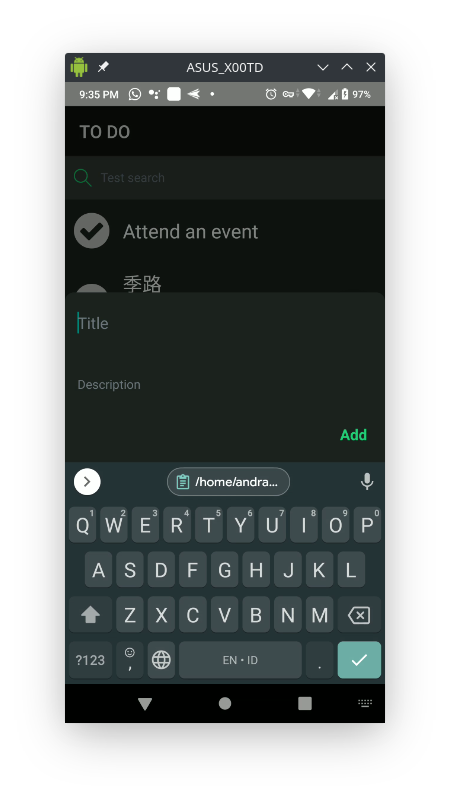
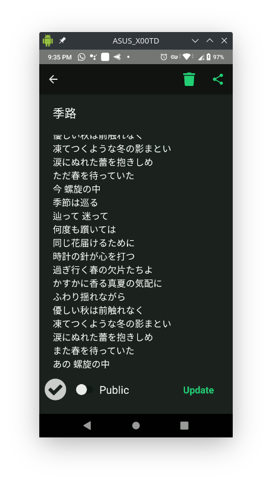
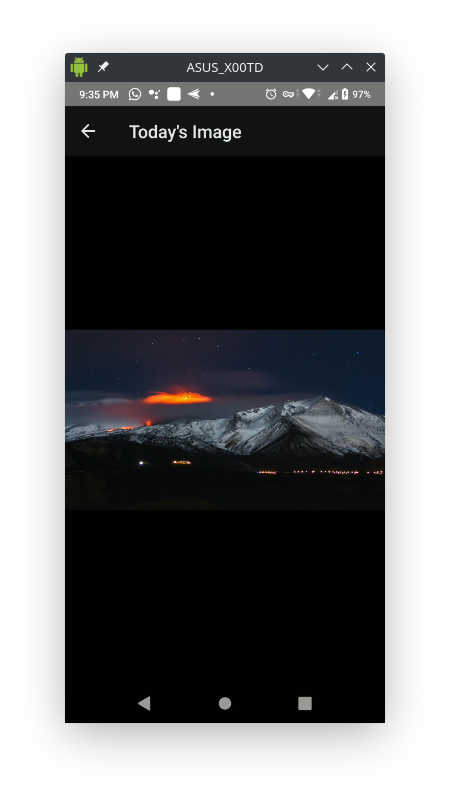
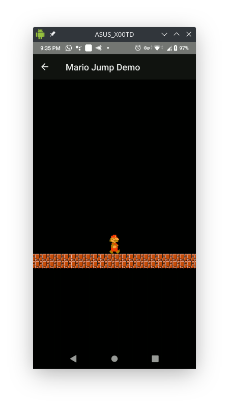

# RN-Challenge
WellMart is a team of fun, fast, and friendly builders. Everyone from interns to the CEO have some level of technical skill. Everyone is judged based on their creation and outcome. Not their background. Not their appearances.

We welcome all kinds of builders, creators, and designers. This challenge is specifically for developers. We don't care much about your resume. If you think you can build awesome products and learn fast. This challenge is for you.

This is a set of open ended challenges for you to show us your skills. Clone this repo, build an awesome app, and open a PR. The whole team will review your creation.

## Instructions
### 1. Learn
- Feel free to learn from any resources. [React Native Website](https://reactnative.dev)
  , [YouTube](https://www.youtube.com/results?search_query=react+native+tutorial), etc.
- We have a udemy account you can borrow (reach out to team@wellmart.id). This one is really good. Please reach out!

### 2. Build
- You have 1 week to complete the challenge. We can see the commits timeline
- Implementation (code) and design (UI/UX) will be evaluated

### 3. Show
- Impress us with your skills
- Go beyond the requirements
- Beat the competition
- Join us
- Win

### Submissions
- Setup your dev environment by following this ([React Native Getting started Guide](https://reactnative.dev/docs/getting-started))
- Clone the challenge repository
- Create a dedicated branch
- Write your code
- Commit your changes
- Fork the challenge repository
- Issue a Pull Request
- Notify us. Please send an email to team@wellmart.id

### Suggestions
- Make it easy for us to try your app. Add instructions on how to run your demo. There's a section below you can fill in
- Don't be afraid if you're still a newbie. We will judge what you built adjusted with your experience. If you're just starting out, but can learn fast. We want you :)
- Make something fun. We love to party too! :D
- You can use Expo or Vanilla React Native. Our codebase is Vanilla (Ejected from Expo) though. Here's to learn more about [Expo workflows](https://docs.expo.io/introduction/managed-vs-bare/)
- Get used to coding in TypeScript
- Be prepared to explain your decisions and your thought process in the next interview. We're curious about how you think! :)

## Challenge
Joko is a very responsible and organized person. He writes down all his to-do items in a day. And clears all the things he needs to do before the day ends

Create a React Native app where Joko can keep track of the things he need to do in his day

## Requirements

Your app should be able to complete these tasks:

- [x] Add a new to-do item
- [x] Mark a to-do item as done
- [x] Delete a to-do item
- [x] Edit a to-do item
- [x] Display all to-dos in a list or a grid
- [x] Filter between completed and incomplete items

### Bonus:

- [x] Enable search for the to-do items
- [ ] Include animations
- [x] Persist data using Contexts and/or Async Storage.
- [x] Call some public API (image, video, weather, clocks, up to you)
- [x] Save data to a backend server (like firebase)
- [x] Do some kind of sharing
- [ ] Somehow make this boring app fun! show some crazy pokemon animation or something :P

## Preview



Create To Do



Edit To Do



Shows you today's image from Bing wallpaper.



Just a mario jumping on the bricks.

## How to run the demo

1. Install the required dependency by executing `yarn install`
2. Run `yarn run android`

### Demo User

You can use a demo user below to sign in to the application.

```
Email: joko@gmail.com
Password: jokojoko
```

## Note

- The application needs to be detached from Expo since the Firebase offline persistence does not work with it.
- I did not have any chance to test the iOS version of the application because I don't have a MacOS machine. If you'd
  like to try the application for iOS and you have a MacOS, you can copy the Google service credential in
  `misc/GoogleService-Info.plist` and follow the guidelines
  here [https://rnfirebase.io/#3-ios-setup](https://rnfirebase.io/#3-ios-setup) .

---

For further inquiries, please email me at andra.antariksa \[at\] gmail.com
