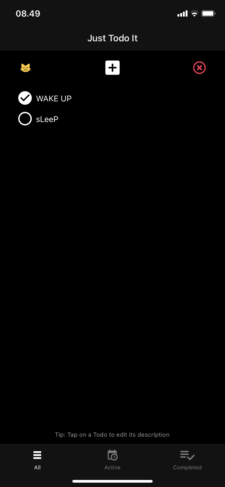
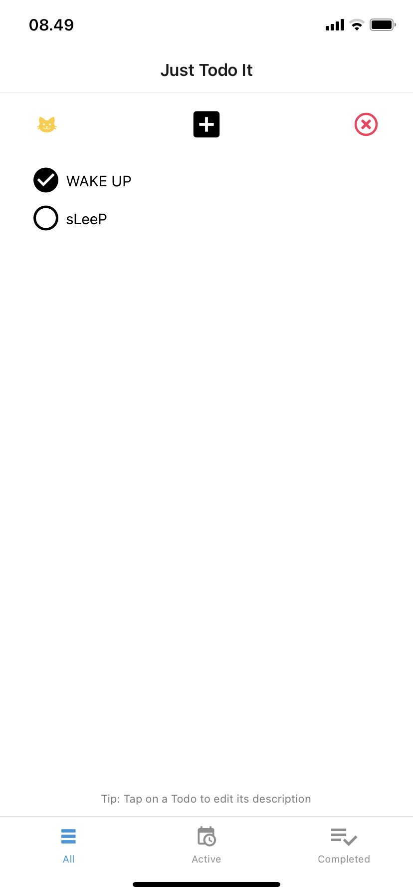
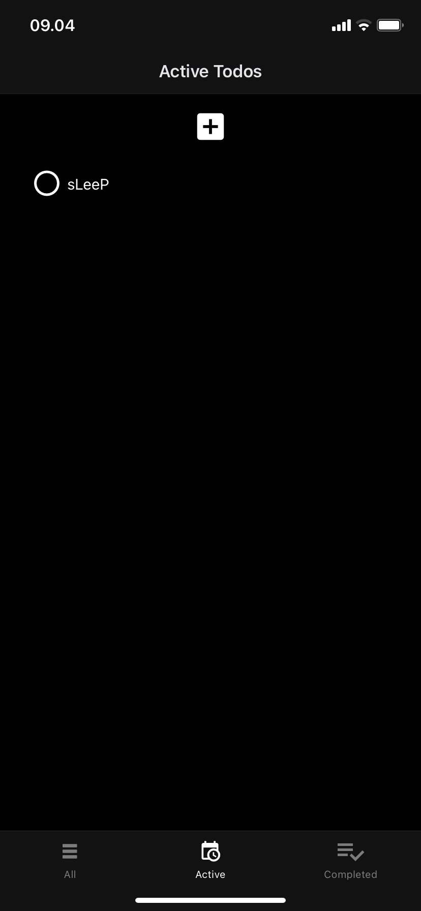
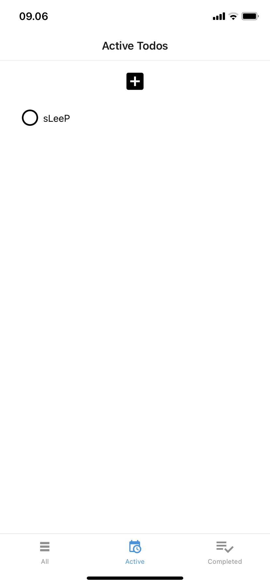
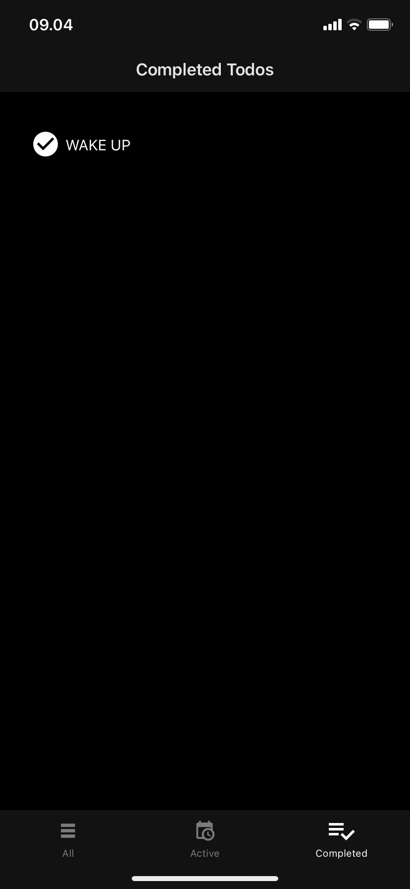
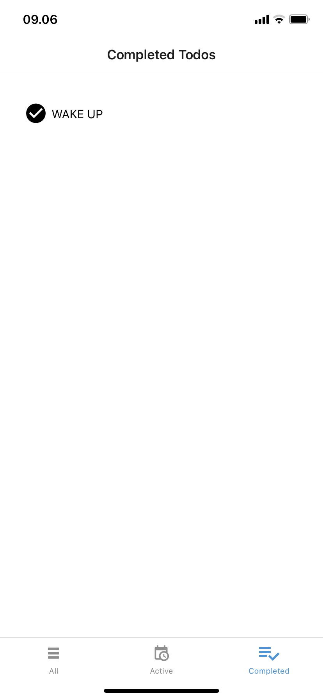
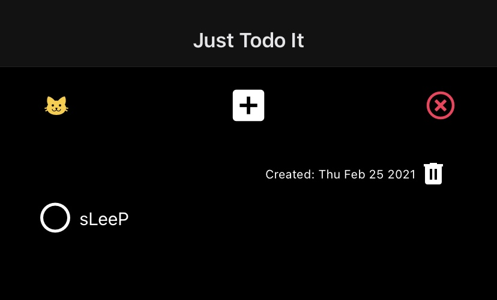

# RN-Challenge
WellMart is a team of fun, fast, and friendly builders. Everyone from interns to the CEO have some level of technical skill. Everyone is judged based on their creation and outcome. Not their background. Not their appearances.

We welcome all kinds of builders, creators, and designers. This challenge is specifically for developers. We don't care much about your resume. If you think you can build awesome products and learn fast. This challenge is for you.

This is a set of open ended challenges for you to show us your skills. Clone this repo, build an awesome app, and open a PR. The whole team will review your creation.

## Instructions
### 1. Learn
- Feel free to learn from any resources. [React Native Website](https://reactnative.dev), [YouTube](https://www.youtube.com/results?search_query=react+native+tutorial), etc. 
- We have a udemy account you can borrow (reach out to contact@wellmart.id). This one is really good. Please reach out!

### 2. Build
- You have 1 week to complete the challenge. We can see the commits timeline
- Implementation (code) and design (UI/UX) will be evaluated

### 3. Show
- Impress us with your skills
- Go beyond the requirements
- Beat the competition
- Join us
- Win

### Submissions
- Setup your dev environment by following this ([React Native Getting started Guide](https://reactnative.dev/docs/getting-started))
- Clone the challenge repository
- Create a dedicated branch
- Write your code
- Commit your changes
- Fork the challenge repository
- Issue a Pull Request
- Notify us. Please send an email to contact@wellmart.id

### Suggestions
- Make it easy for us to try your app. Add instructions on how to run your demo. There's a section below you can fill in
- Don't be afraid if you're still a newbie. We will judge what you built adjusted with your experience. If you're just starting out, but can learn fast. We want you :)
- Make something fun. We love to party too! :D
- You can use Expo or Vanilla React Native. Our codebase is Vanilla (Ejected from Expo) though. Here's to learn more about [Expo workflows](https://docs.expo.io/introduction/managed-vs-bare/)
- Get used to coding in TypeScript
- Be prepared to explain your decisions and your thought process in the next interview. We're curious about how you think! :)

## Challenge
Joko is a very responsible and organized person. He writes down all his to-do items in a day. And clears all the things he needs to do before the day ends

Create a React Native app where Joko can keep track of the things he need to do in his day

## Requirements
Your app should be able to complete these tasks:
- Add a new to-do item
- Mark a to-do item as done
- Delete a to-do item
- Edit a to-do item
- Display all to-dos in a list or a grid
- Filter between completed and incomplete items

### Bonus:
- Enable search for the to-do items
- Include animations
- Persist data using Contexts and/or Async Storage
- Call some public API (image, video, weather, clocks, up to you)
- Save data to a backend server (like firebase)
- Do some kind of sharing
- Somehow make this boring app fun! show some crazy pokemon animation or something :P

## How to run the demo
To run this React Native app, you can run this locally or from the Expo website.

### Running and building on your computer using Expo:

Be sure to have installed NPM and Node 12 LTS or greater installed, then run this on your terminal:

```bash
npm install -g expo-cli
```

Then in the root directory of the repository, run this:

```bash
npm start
```

A local webpage will be opened on your browser which will contain a QR code to scan on your mobile device.

Download the 'Expo Go' app on your mobile device and scan the QR code using your phone's camera, the app should open and run through the Expo app.


### Running from the Expo Website:

Alternatively if you're using Android, you can just download the 'Expo Go' app and scan the QR code from the public project page on the Expo website through this link: https://expo.io/@alifyandra/projects/just-todo-it

If you're using iOS however, you will have to opt for the first option.


------


### App Features:

This app uses the AsyncStorage library to store Todo List data on your mobile device, it consists of 3 screen tabs that share the same Todo List component:

- ##### All Todos Screen:

  This screen contains components that consist of:

  - an Add Todo button that triggers a modal prompting user to enter a description for the new Todo item.
  - a Clear All Todos button that triggers a modal confirming if a user want to clear all todos.
  - a Cat button! which triggers a modal that displays random images of cats from the https://thecatapi.com/ 🐱

  	

  

- ##### Active Todos Screen:

  This screen displays all active todos and contains the same Todo list component along with the same Add Todo button from the All Todos Screen on the topbar.

    
  
  
  
- ##### Completed Todos Screen:

  This screen only displays completed todos and uses the Todo list component shared by all screens.

    

- ##### Todo List Component Features:

  The Todo List component consists of a clickable check button that changes the state of a todos completeness and a description which can be clicked that triggers a modal to edit the description.

  The rows of each Todo List can be swiped left to display the date of the todo's creation as well as a delete button for you to delete the individual todo.

  

  

------


For further inquiries hit me up at alifyandra@gmail.com 

Cheers! 🖐

