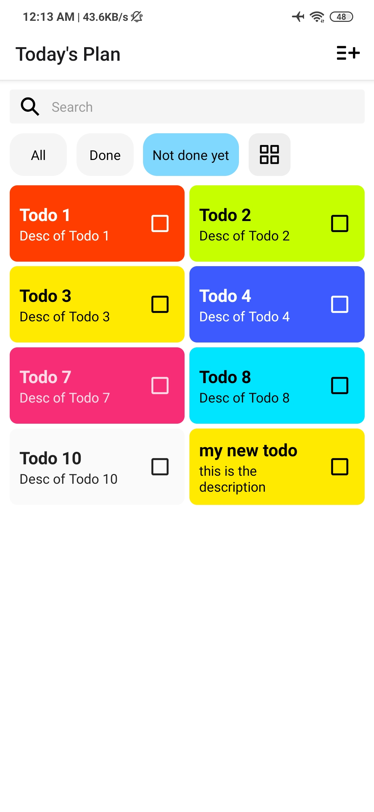

# RN-Challenge
WellMart is a team of fun, fast, and friendly builders. Everyone from interns to the CEO have some level of technical skill. Everyone is judged based on their creation and outcome. Not their background. Not their appearances.

We welcome all kinds of builders, creators, and designers. This challenge is specifically for developers. We don't care much about your resume. If you think you can build awesome products and learn fast. This challenge is for you.

This is a set of open ended challenges for you to show us your skills. Clone this repo, build an awesome app, and open a PR. The whole team will review your creation.

## Instructions
### 1. Learn
- Feel free to learn from any resources. [React Native Website](https://reactnative.dev), [YouTube](https://www.youtube.com/results?search_query=react+native+tutorial), etc. 
- We have a udemy account you can borrow (reach out to team@wellmart.id). This one is really good. Please reach out!

### 2. Build
- You have 1 week to complete the challenge. We can see the commits timeline
- Implementation (code) and design (UI/UX) will be evaluated

### 3. Show
- Impress us with your skills
- Go beyond the requirements
- Beat the competition
- Join us
- Win

### Submissions
- Setup your dev environment by following this ([React Native Getting started Guide](https://reactnative.dev/docs/getting-started))
- Clone the challenge repository
- Create a dedicated branch
- Write your code
- Commit your changes
- Fork the challenge repository
- Issue a Pull Request
- Notify us. Please send an email to team@wellmart.id

### Suggestions
- Make it easy for us to try your app. Add instructions on how to run your demo. There's a section below you can fill in
- Don't be afraid if you're still a newbie. We will judge what you built adjusted with your experience. If you're just starting out, but can learn fast. We want you :)
- Make something fun. We love to party too! :D
- You can use Expo or Vanilla React Native. Our codebase is Vanilla (Ejected from Expo) though. Here's to learn more about [Expo workflows](https://docs.expo.io/introduction/managed-vs-bare/)
- Get used to coding in TypeScript
- Be prepared to explain your decisions and your thought process in the next interview. We're curious about how you think! :)

## Challenge
Joko is a very responsible and organized person. He writes down all his to-do items in a day. And clears all the things he needs to do before the day ends

Create a React Native app where Joko can keep track of the things he need to do in his day

## Requirements
Your app should be able to complete these tasks:
- Add a new to-do item
- Mark a to-do item as done
- Delete a to-do item
- Edit a to-do item
- Display all to-dos in a list or a grid
- Filter between completed and incomplete items

### Bonus:
- Enable search for the to-do items
- Include animations
- Persist data using Contexts and/or Async Storage
- Call some public API (image, video, weather, clocks, up to you)
- Save data to a backend server (like firebase)
- Do some kind of sharing
- Somehow make this boring app fun! show some crazy pokemon animation or something :P

## Features

- Add, edit, update, or delete a Todo
- Search for Todos
- Change card color
- View by list or grid

### Home

### Add or Edit a Todo
  

Here you can do:
- Add a Todo by tapping on the top-right button.
- Edit a Todo by tapping on the card.
- Specify the title and the description for the Todo and you can choose the color for the card.
- Mark a Todo as done/undone is easy, just tick or untick the check box on the right of the card. - Remove an item by long tapping on the card and click on the trash button. If you want to cancel it, just press the red cross button.

Note: Changes (new item or updating one) will be automatically saved once user leaves the Todo Detail Screen

### Search for Todos
   

You can find some todos by specifying the keyword in the search bar, and if you want to sort the items by done or undone just tap on the "Done" or "Not done yet" button on top of the list.
Changing the view is easy, there's a 4th button on top of the list, click on it to see the change :)

