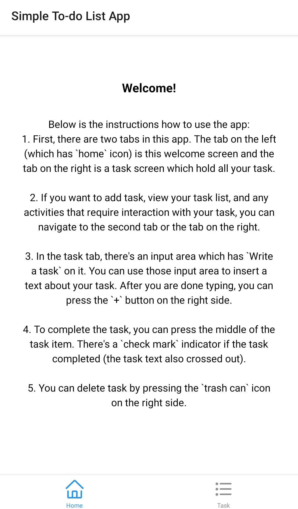
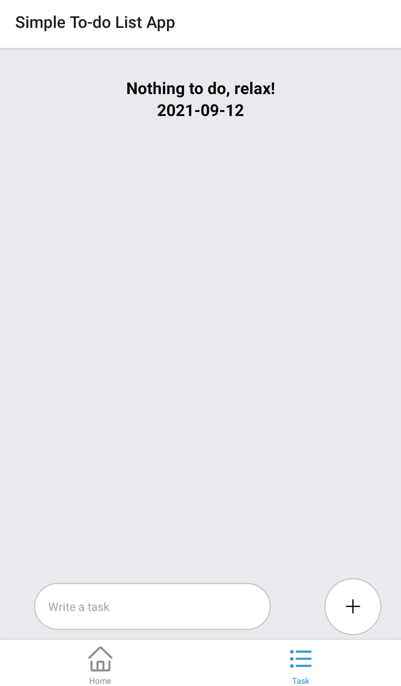
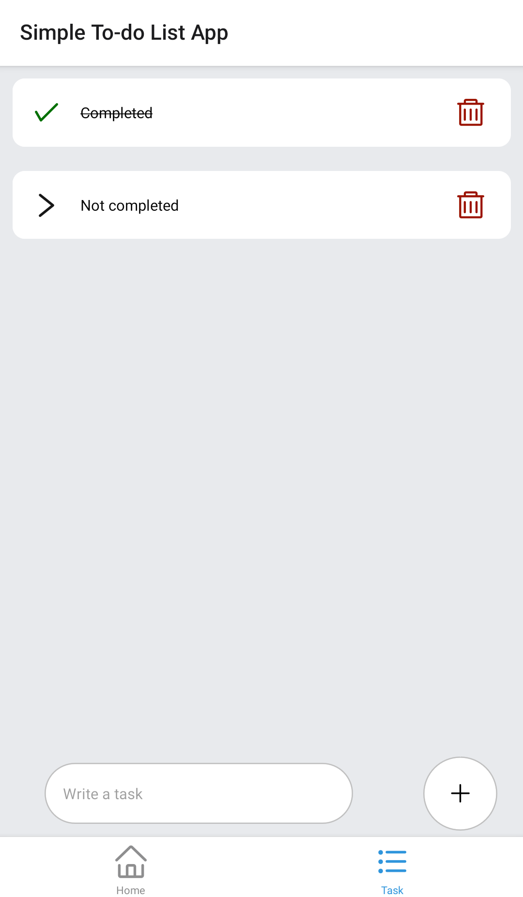

# RN-Challenge
MoneyHub is a team of fun, fast, and friendly builders. Everyone from interns to the CEO have some level of technical skill. Everyone is judged based on their creation and outcome. Not their background. Not their appearances.

We welcome all kinds of builders, creators, and designers. This challenge is specifically for developers. We don't care much about your resume. If you think you can build awesome products and learn fast. This challenge is for you.

This is a set of open ended challenges for you to show us your skills. Clone this repo, build an awesome app, and open a PR. The whole team will review your creation.

## Instructions
### 1. Learn
- Download the [MoneyHub App](http://onelink.to/x9xxwg). Try to understand how the features are implemented. If you join the team, you'll be the one making these features!
- Feel free to learn from any resources. [React Native Website](https://reactnative.dev), [YouTube](https://www.youtube.com/results?search_query=react+native+tutorial), etc.
- We have a udemy account you can borrow (reach out to [team@moneyhub.id](mailto:team@moneyhub.id)). This one is really good. Please reach out!
- Understand how GitHub works. It's a standard tool in the industry. [GitHub Tutorial](https://guides.github.com/activities/hello-world/)

### 2. Build
- You have 1 week to complete the challenge. We can see the commits timeline
- Implementation (code) and design (UI/UX) will be evaluated

### 3. Show
- Impress us with your skills
- Go beyond the requirements
- Beat the competition
- Join us
- Win

### Submissions
- Setup your dev environment by following this ([React Native Getting started Guide](https://reactnative.dev/docs/getting-started))
- Fork the challenge repository
- Clone the challenge repository
- Create a dedicated branch
- Write your code
- Commit your changes
- Issue a Pull Request
- Notify us. Please send an email to [team@moneyhub.id](mailto:team@moneyhub.id)

### Suggestions
- Make it easy for us to try your app. Add instructions on how to run your demo. There's a section below you can fill in
- Don't be afraid if you're still a newbie. We will judge what you built adjusted with your experience. If you're just starting out, but can learn fast. We want you :)
- Make something fun. We love to party too! :D
- You can use Expo or Vanilla React Native. Our codebase is Vanilla (Ejected from Expo) though. Here's to learn more about [Expo workflows](https://docs.expo.io/introduction/managed-vs-bare/)
- Get used to coding in TypeScript. But JavaScript is okay
- Be prepared to explain your decisions and your thought process in the next interview. We're curious about how you think! :)

## Challenge
Joko is a very responsible and organized person. He writes down all his to-do items in a day. And clears all the things he needs to do before the day ends

Create a React Native app where Joko can keep track of the things he need to do in his day

## Requirements
Your app should be able to complete these tasks:
- Add a new to-do item
- Mark a to-do item as done
- Delete a to-do item
- Edit a to-do item
- Display all to-dos in a list or a grid
- Filter between completed and incomplete items

### Bonus
- Enable search for the to-do items
- Include animations
- Persist data using Contexts and/or Async Storage
- Call some public API (image, video, weather, clocks, up to you)
- Save data to a backend server (like firebase)
- Do some kind of sharing
- Somehow make this boring app fun! show some crazy pokemon animation or something :P

## How to run the demo
### Setup environment

#### Desktop
- Make sure you have node installed. For unix-like OS (Linux/Mac OS), you can use `command -v node` from your terminal emulator. If there's no output, please install the node first by download the package from [node website](https://nodejs.org/en/download/) or using your OS package manager (apt, brew, etc).
- Make sure you have expo installed. For unix-like OS (Linux/Mac OS), you can use `command -v expo` from your terminal emulator. If there's no output, you can install expo by using this command in your terminal emulator:
```sh
npm install -g expo-cli
```
> If there's an error please take a look at [npm documentation](https://docs.npmjs.com/resolving-eacces-permissions-errors-when-installing-packages-globally).
- Clone this repo by using your favorite git GUI client or this command in your terminal emulator:
```sh
git clone https://github.com/bruhtus/RN-Challenge/tree/bruhtus
```
- After that change directory to the new git repo directory by using this command (assuming you didn't change the directory name or put another argument after the url when using `git clone` command) in your terminal emulator:
```sh
cd RN-Challenge
```
- Please make sure you are in the right directory by using `pwd` command and the output is along this line:
```sh
# like the name implied, optional-directory is optional
# so if you clone the git repo in your home directory, then you can omitted
# the optional-directory
/home/<username>/<optional-directory>/RN-Challenge
```
- After everything clear, install node modules by using this command in your terminal emulator:
```sh
npm install
```
- And then start the app by using this command in your terminal emulator:
```sh
npm start
```
> If those command didn't open the browser automatically, you can use the localhost address like `localhost:19002` in your web browser to access the log interface (there's also a barcode that we will use later). <br>
> Please check the output of the `npm start` for the localhost address.

#### Phone
- Install expo app from Google Play Store or App Store with the icon similar to this: <br>

- For android:
  - Open the app (the app is `Expo go` or something along those lines)
  - Select `Scan QR Code`
  - Scan the QR code
- For iOS:
  - Open camera app.
  - Point out the camera to the QR code.
  - Select the notification `Expo QR Code` or something similar.
- Wait until the `Building JavaScript bundle` finished.
- Finally, use the demo (the instructions in the next section).

### Demo instructions
1. First, there are two tab in this tab. The tab on the left (which has `home` icon) is welcome screen and the tab on the right is a task screen which hold all your task.
2. If you want to add task, view your task list, and any activities that require interaction with your task, you can navigate to the second tab or the tab on the right.
3. In the task tab, there's an input area which has `Write a task` on it. You can use those input area to insert a text about your task. After you are done typing, you can press the `+` button on the right side.
4. To complete the task, you can press the middle of the task item. There's a `check mark` indicator if the task completed (the task text also crossed out).
5. You can delete task by pressing the `trash can` icon on the right side.

#### Demo interface
<details>
<summary><strong>Welcome screen (click to expand)</strong></summary>



</details>

<details>
<summary><strong>Task screen (click to expand)</strong></summary>

<h4>Empty task interface</h4>



<h4>Completed and not completed interface</h4>



</details>

## References
- [Udemy course: Complete React Native and Redux](https://www.udemy.com/course/the-complete-react-native-and-redux-cours/).
- [Made With Matt youtube tutorial](https://www.youtube.com/playlist?list=PLYBvEAka-q1hJuwRPYQPlEBBRm7_qGw_2).
- [Building a To-Do List with React-Native and Styled-Components](https://dev.to/reenydavidson/building-a-to-do-list-with-react-native-and-styled-components-2148).
- [Stackoverflow comment about completed task](https://stackoverflow.com/q/66427843).
- [Geekforgeeks: how to add key-value pairs dynamically](https://www.geeksforgeeks.org/how-to-create-dictionary-and-add-key-value-pairs-dynamically/).
